# Cowork Starter Kit

> Describe your goal in plain language. Claude Cowork builds a personalized, skill-equipped workspace from vetted, SHA-pinned skills — no code, no template hunting, three quick turns, about 15 minutes (an estimate — see [methodology](tests/offline-smoke-test.md)). Then it keeps working: your workspace notices its own friction, proposes fixes you approve one at a time, and safely pulls skill updates — every change confirm-first, never silent, always reversible.

[](https://github.com/jmlozano1990/cowork-starter-kit/actions/workflows/quality.yml)
[](LICENSE)
[](https://github.com/jmlozano1990/Cowork-Starter-Kit/blob/main/CHANGELOG.md)
[](https://github.com/jmlozano1990/Cowork-Starter-Kit)
[](CONTRIBUTING.md)

---

## See it in action



A synthetic demo of the real 3-turn interview: describe a goal, confirm a skill bundle, answer one quick turn, and land on a personalized workspace with skills already installed. **In a hurry?** One open-ended question is enough to get a working bundle — everything else is optional customization or can be answered later.

---

## Two things this kit does

**1. It builds your workspace.** Describe a goal in plain language. Three quick turns later you have a personalized `CLAUDE.md`, a skill bundle drawn from a 25-skill curated pool, and a writing profile tuned to your voice — no code, no template hunting.

**2. It keeps that workspace sharp.** Once you're working, the kit doesn't just sit there:

- **It notices recurring friction** — the same correction, the same repeated ask, three separate days — and proposes a plain-language fix: here's what I noticed, here's the exact change, you decide.
- **It proposes cleaning up after itself** — a stale or superseded file gets moved (never deleted) into a local archive, only after you confirm the exact move.
- **It safely pulls curated-skill updates** — checks what you have installed against the current pool, flags anything you've customized so nothing gets silently overwritten, and only applies what you approve.
- **It carries a path to walk its own framework forward** — a dormant-but-reachable contract for upgrading the kit's own machinery across future versions, gated by a stricter rule than any of the above: new safety machinery must prove itself under the *old* gate before it's ever trusted to replace it.

None of this happens silently. Every one of these is propose-then-confirm, and every write is reversible.

---

## Why trust it

This kit exists because the AI-agent skill ecosystem it plugs into has real, documented problems — and it's built specifically to avoid them, not just to claim it does. Two supply-chain threats, and a third that comes from the kit's own newest capability:

- **Community skills are frequently unsafe.** Snyk's February 2026 ToxicSkills study scanned 3,984 public agent skills and found 36.82% (1,467 skills) had at least one security flaw, with 76 confirmed-malicious payloads built for credential theft, backdoors, or data exfiltration.
- **Prompt injection via pasted or uploaded content is a live threat, not theory.** PromptArmor disclosed in January 2026 that Claude Cowork itself could be manipulated, via a booby-trapped file, into exfiltrating a user's data through an allowlisted API endpoint.
- **A workspace that can edit its own instructions is a different risk shape than a static skill file.** The surface that watches your workspace's behavior is the same surface that can change it.

This kit's answer to the first two: every upstream skill is **SHA-pinned** in `cowork.lock.json` (not tracking a branch), **vendored inside this repo** so nothing is fetched at runtime, and **attribution-injected** (ADR-024) before it ever reaches your workspace — with human review and a 24-hour soak before any upstream update ships.

Its answer to the third — **self-integrity**: every self-modifying path (proposing a fix, archiving a file, pulling a skill update, or the dormant engine-upgrade path) runs behind a fixed, named allow-list, requires an explicit confirmation showing the literal change before anything lands, is checked by an automated verifier, and rolls back automatically if that check fails. Changing the safety machinery itself is a stricter, separate step: the new machinery has to pass verification *under the old, still-active gate* before it's ever allowed to take over — never the reverse. This is inspection-class and human-boundary containment, not a claim that an out-of-scope write is physically impossible — read the honest version in **[TRUST.md](TRUST.md)**.

---

## Who is this for

- **Students and exam preppers** — set up a study workspace with flashcard generation, note-taking, and research synthesis in one guided session
- **Knowledge workers and analysts** — configure a research or project workspace tuned to your writing voice and goal — no template hunting required
- **Project managers and team leads** — spin up a status-update, meeting-notes, and risk-tracking workspace without touching a config file

---

## How it works

Open this folder as a Cowork Project. Cowork auto-loads `CLAUDE.md` as system context and runs the setup wizard the moment you start talking — one open-ended goal question, a bundle confirm, one quick turn for name/role/deadlines, and an optional voice-calibration turn. No terminal required. No paste required. **Zero runtime fetches, fully reviewable supply chain** — everything the wizard installs already ships inside this repo; nothing is downloaded during setup (see "Why trust it" above).

```
You                                Cowork
 |                                    |
 |  Open the cowork-starter-kit       |
 |  folder as a Cowork Project        |
 | ---------------------------------> |
 |                                    |  Auto-loads CLAUDE.md
 |                                    |  as system context
 |                                    |
 |  Start conversation                |
 | ---------------------------------> |
 |                                    |  "What do you need help with?"
 |  [your goal in your own words]     |
 | ---------------------------------> |
 |                                    |  Routes goal (Path A: preset match,
 |                                    |  Path B: overlap narrowing,
 |                                    |  Path C: from-scratch composition)
 |                                    |  Confirms bundle, then one quick
 |                                    |  turn for name/role/deadlines
 |  [your answers]                    |
 | ---------------------------------> |
 |                                    |  Generates + hands over:
 |                                    |    personalized CLAUDE.md
 |                                    |    cowork-profile.md
 |                                    |    context/ folder + skill files
 |                                    |    installer archived to
 |                                    |    _setup-kit/ (Step 7 handover)
 |  "Setup complete."                 |
 | <--------------------------------- |
 |                                    |
 |  Type /setup-wizard                |
 | ---------------------------------> |  Explicit fallback — redo setup
```

**Two alternative entry paths** if you can't open the folder directly:

- Paste `examples/<name>/project-instructions-starter.txt` into Project Settings > Custom Instructions — a fully self-contained copy of the same interview, no folder access needed.
- Type `/setup-wizard` inside any Cowork project to invoke the wizard explicitly.

---

## Quick start

- Toggle **Extended Thinking** ON in Cowork before you start
- Select the most capable model available in your plan from the model dropdown

1. **[Download ZIP](https://github.com/jmlozano1990/cowork-starter-kit/archive/refs/heads/main.zip)** — unzip anywhere on your computer
2. Open Claude Cowork → create a new Project → point it at the unzipped folder
3. Start talking — the wizard runs automatically

That's it. Cowork reads the project instructions and walks you through personalized setup.

**Setup ends with a clean handover.** When the wizard finishes, it replaces `CLAUDE.md` with your personalized workspace instructions and archives the entire installer into `_setup-kit/` (moved, never deleted) — your project folder contains your files, not setup machinery.

**Setup works fully offline.** Everything the wizard installs ships inside the ZIP — skills are copied from the local `skills/` folder, never downloaded. If Claude mentions it can't reach github.com or the internet during setup, that's normal and blocks nothing (see the troubleshooting section in `SETUP-CHECKLIST.md`). Web access is only needed for optional web research features, never for setup.

> **Alternative paths:** Type `/setup-wizard` to run or redo setup explicitly. Or paste `examples/<name>/project-instructions-starter.txt` into Project Settings > Custom Instructions for a fully self-contained onboarding from message one.
>
> **No Cowork yet?** Use the manual path: open `SETUP-CHECKLIST.md` and follow every step by hand.

---

## What's included

You don't need to know which preset fits your goal — the wizard figures it out. Here are three examples:

| Goal you describe | What the wizard builds |
|-------------------|----------------------|
| "I'm a biochemistry student studying for finals" | Study workspace — flashcard generation, note-taking, research synthesis, academic writing profile |
| "I'm managing a job search and want to track applications" | Career Manager workspace — application tracker, interview prep, resume tailor, professional writing profile |
| "I want to plan a home renovation and stay organized" | Project workspace — task tracking, stakeholder updates, decision log, direct communication writing profile |

The 7 selection presets are starting suggestions — the wizard uses them as scaffolds when your goal matches closely (Path A), narrows across overlapping presets with a follow-up question (Path B), or drafts a custom team from the unified skill pool when no preset fits (Path C).

### Goal presets

You describe your goal in plain language. The wizard routes to the closest preset suggestion, narrows between overlapping presets, or drafts a custom team if nothing fits. These are the 7 selection presets it can suggest:

| Preset | Best for | What you get |
|--------|----------|--------------|
| **Study** | Students, exam prep, coursework | Research synthesis, note-taking, flashcard generation |
| **Research** | Academics, analysts, lit review | Literature review, source analysis, synthesis |
| **Writing** | Authors, bloggers, journalists | Voice matching, editing pass, outline generator |
| **Project Management** | PMs, team leads, ops | Status updates, meeting notes, risk assessment |
| **Creative** | Designers, storytellers, strategists | Ideation, creative brief, feedback synthesis |
| **Business/Admin** | Executives, assistants, owners | Email drafting, report summary, action items |
| **Personal Assistant** | Individuals managing daily life | Daily briefing, follow-up tracker, spend awareness |

**Each preset includes:**

- `project-instructions-starter.txt` — self-contained manual entry path: paste into Project Settings > Custom Instructions to run the same interview without opening the repo folder (functionally equivalent to `CLAUDE.md` auto-load)
- `global-instructions.md` — proactive skill trigger rules (session behavior) with writing profile integration
- `context/about-me.md` — fill in your name, role, and goals
- `context/working-rules.md` — safe defaults (includes confirm-before-delete rule)
- `context/output-format.md` — pre-filled for your preset
- `context/writing-profile.md` — goal-appropriate writing voice defaults
- `connector-checklist.md` — which connectors to authorize and why
- `skills-as-prompts.md` — skill content as copy-paste prompts if skill upload is unavailable
- `folder-structure.md` — recommended folder layout for your workspace
- `.claude/skills/<skill-name>/SKILL.md` — 3 deprecation-stub skills (canonical versions live in the unified `skills/` pool)

### Highlights

- **Open-ended goal discovery** — no preset menu. The wizard turns your description into a draft you shape: Path A drafts a close preset match, Path B offers two draft directions for overlapping presets, Path C drafts a custom team from the unified pool — three equally first-class starting drafts, not a fast path and a fallback.
- **Unified skill pool** — 25 skills (`skills/<slug>/SKILL.md`) consolidated into a single canonical source, including an authenticity pass (`anti-ai-slop`) and a periodic GTD review (`weekly-review`). The wizard composes your bundle from this pool regardless of which path it takes.
- **Selection presets as suggestions** — 7 named presets in `selection-presets.md` are starting templates the wizard suggests, not exclusive choices. Users confirm and customize from there.
- **Draft-then-shape bundle building** — the wizard proposes a skill bundle as a draft you shape, surfacing a few suggestions at a time and adding more whenever you ask. You confirm when it's right. No batch-install surprises.
- **A workspace that maintains itself** — a personal mini-Council watches for recurring friction and proposes a fix in plain language; a Steward proposes archiving stale files; `pull-updates` checks your installed skills against the curated pool and offers safe, per-item updates. All three are confirm-first, verified, and reversible on failure — see "Two things this kit does," above.
- **ADR-024 attribution preserved** — every skill installed from the pool includes a verified attribution block. No skill installs without it.
- **Writing profile for every workspace** — an optional voice-calibration turn tunes Cowork to your voice; every workspace ships with a goal-appropriate `writing-profile.md`.
- **Curated skills registry** — `curated-skills-registry.md` lists vetted skills with descriptions, source URLs, and goal tags.
- **Proactive skills** — Cowork offers flashcards when you share study material, suggests synthesis when you reference multiple sources, drafts status updates when a deadline is near.
- **`/setup-wizard`** — explicit command to run or redo setup anytime.

---

## How to extend

Want to go deeper? Three paths:

- **Add a preset** — copy `templates/preset-template/` and follow the guide in [`CONTRIBUTING.md`](https://github.com/jmlozano1990/Cowork-Starter-Kit/blob/main/CONTRIBUTING.md). Your new preset joins the wizard's suggestion pool.
- **Explore the architecture** — `docs/architecture.md` contains all ADRs and Phase 1 design records from v1.0 to present. See also [How it works, in depth](docs/how-it-works.md).
- **Author a skill** — start from `templates/skill-template/` for the 9-section format the wizard installs.

---

## Safety first

Every preset includes a non-negotiable rule: **Cowork will always ask for your confirmation before deleting, moving, or overwriting any file or folder.** This rule is built into every workspace this wizard generates and is enforced by CI on every community contribution.

The same discipline governs everything the workspace does to itself — noticing friction, archiving a file, pulling a skill update: propose, show you the literal change, wait for a yes, verify it worked, and undo it automatically if it didn't.

---

## Supply-Chain Integrity

All upstream content from `msitarzewski/agency-agents` is SHA-pinned in `cowork.lock.json` and **ships vendored inside this repo** at `vendored/agency-agents/` — 110 agent files, each fetched at the pinned commit, checksum-verified against the lock, and attribution-injected (ADR-024) before commit. CI re-verifies the vendored tree against the lock on every pull request (`vendored-integrity-check`), fully offline. Nothing is downloaded at runtime — sessions need no GitHub access. The `/sync-agency` CI workflow opens a PR on every upstream SHA bump — no content reaches users without human review. See **[TRUST.md](TRUST.md)** for the full threat model.

> **Trust boundary:** The `cowork.lock.json` file is the integrity anchor for upstream content. If you cloned this repo from a fork or modified the lock file locally, the supply-chain guarantees do not apply. Always install from a trusted clone of cowork-starter-kit's main repository.

---

## Recent releases

v2.19 taught the kit to keep its own installed skills current — checking what's on disk against the curated pool and offering safe, per-item updates, never a silent overwrite. v2.16–v2.18 built the machinery that makes that possible: a workspace that can propose a fix for its own recurring friction, archive a stale file, and (not yet active) walk its own framework forward across future kit versions — every step confirm-first, verified, and reversible. Full history: **[CHANGELOG.md](CHANGELOG.md)** · **[Releases](https://github.com/jmlozano1990/cowork-starter-kit/releases)**.

**Next up:** **v2.20** — a maintainer-reviewed path for community skill submissions, opening once real contributor demand shows up (not on a fixed schedule). **v3.0 — "The Engine"** — the North-Star release: from a live workspace, ask for a new capability and it spawns a fully-capable, isolated sibling workspace from the local pool, carrying your latest skills. Its own dedicated design cycle comes first.

---

## Staying up to date

This repo uses [semantic versioning](https://github.com/jmlozano1990/cowork-starter-kit/releases). When a new version ships, check the [Releases](https://github.com/jmlozano1990/cowork-starter-kit/releases) tab. The [CHANGELOG](https://github.com/jmlozano1990/Cowork-Starter-Kit/blob/main/CHANGELOG.md) lists which presets changed. To update: download the new preset folder and replace only the template files. Your `cowork-profile.md` and `project-instructions-starter.txt` are yours and are never overwritten. Already have a workspace running? Ask it to run `pull-updates` to check your installed skills against the current pool.

---

## Contribute a preset

Want to add a preset for a use case not covered here? See [CONTRIBUTING.md](https://github.com/jmlozano1990/Cowork-Starter-Kit/blob/main/CONTRIBUTING.md) — the templates/preset-template/ folder gives you a ready-to-fill scaffold. All contributions require a DCO sign-off and pass CI automatically.

---

## Star this repo

If this saved you setup time, a star helps other Claude Cowork users find it.

---

## Credits / Attribution

MIT — see LICENSE.

Upstream skill content sourced from [msitarzewski/agency-agents](https://github.com/msitarzewski/agency-agents) (MIT). Full third-party notices in [THIRD-PARTY-NOTICES.md](THIRD-PARTY-NOTICES.md).

Want to contribute? See [CONTRIBUTING.md](https://github.com/jmlozano1990/Cowork-Starter-Kit/blob/main/CONTRIBUTING.md).
